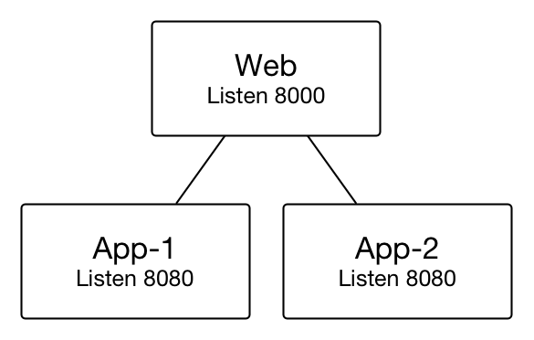

# Master Of Puppets



## Dependencies

**Software dependencies.**

* VirtualBox
* Vagrant

## Running stack
For run and build web with 2x GO app just need to run:
```
make stack
```
so now you can check the stack "http://localhost:8000"

### Destroy stack
Run this command to destroy stack
```
make destroy_stack
```

## Running single node (web | app-1 | app-2)
If you need to run one of nodes and connect to vagrant machine you just need to run this command:
```
make machine ROLE=web
make machine ROLE=app-1
make machine ROLE=app-2
```
### Destroy node
```
make destroy_machine ROLE=web
make destroy_machine ROLE=app-1
make destroy_machine ROLE=app-2
```

## Travis-CI

You can see a build status on Travis-CI: https://travis-ci.org/ali-karimkhani/master_of_puppets
